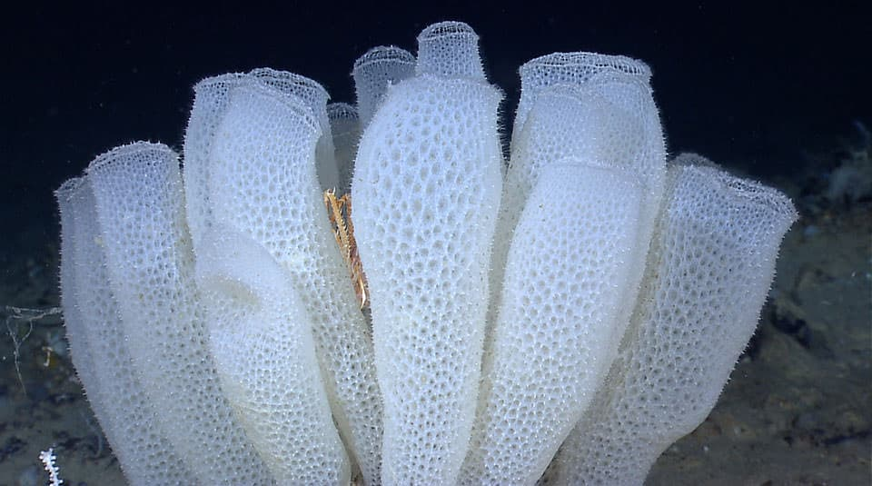

# Deep-Sea Glass Sponge Community Ecology — Hawaiian Archipelago

A reproducible analysis of how depth and geography structure deep-sea glass sponge (Class: Hexactinellida) communities in the Main Hawaiian Islands, using observational records from NOAA's Office of Ocean Exploration and Research.



*A deep-sea glass sponge (Hexactinellida). Image: NOAA Office of Ocean Exploration and Research (public domain).*

---

## View the Report

- **Full interactive report (HTML):** https://diegojocodes.github.io/Glass-Sponge-Community-Ecology/ — best experience, with a floating table of contents, collapsible code, and all figures. *(Available once GitHub Pages is enabled — see below.)*
- **Printable version (PDF):** [`output/glass_sponge_hawaii_analysis.pdf`](output/glass_sponge_hawaii_analysis.pdf) — renders directly in GitHub; click to read or download.

<details>
<summary>How to publish the HTML link (one-time setup)</summary>

1. In RStudio, knit the report to HTML, then rename the output to `index.html` and place it in the repository root (or in a `docs/` folder).
2. On GitHub, go to **Settings → Pages**.
3. Under **Build and deployment → Source**, choose **Deploy from a branch**, select the `main` branch and the folder containing `index.html` (root or `/docs`), and save.
4. Wait a minute, then the report will be live at `https://diegojocodes.github.io/Glass-Sponge-Community-Ecology/`.

</details>

---

## Background

Glass sponges are ecologically important deep-sea filter feeders that build structurally complex habitat on hard substrate. In the Hawaiian Archipelago they occur from the upper bathyal zone to well below 2,000 m, but their distribution is known largely from opportunistic remotely operated vehicle (ROV) and submersible dives rather than standardized surveys. That sampling history makes the data valuable but also demands care: dive effort, gear, and depth coverage vary widely between sites, so apparent ecological patterns can be sampling artifacts unless explicitly controlled for.

This project asks how much of the observed community structure can be defended as ecology — primarily depth zonation — once sampling design is accounted for honestly.

## Research Questions

The questions are ranked by how strongly the data can answer them, and the analysis is framed accordingly.

1. **Primary — Does depth structure the community and its diversity?** Records are dense across the depth range, so this is the strongest, best-supported question.
2. **Secondary — Which environmental variables (depth, latitude, longitude) drive community composition, and is any geographic pattern distinguishable from simple distance-decay?**
3. **Conditional — Is there a residual difference between islands** *after* controlling for depth and the sampling-gear confound, and does it survive robustness checks?
4. **Descriptive — Which taxa are characteristic of each island?**

The island contrast is treated as secondary and conditional throughout: it is reported only as variation explained beyond depth and gear, and only if it survives the sensitivity analyses below.

## Data

| | |
|---|---|
| **Provider** | NOAA Office of Ocean Exploration and Research |
| **Dataset** | Deep-sea glass sponge observations, Hawaiian Archipelago |
| **Records** | 964 observations (raw) |
| **Key variables** | Scientific name & taxonomic rank, depth (m), latitude/longitude, locality, dive identifiers (Station, EventID, SurveyID), sampling gear, observation date |
| **Access** | [NOAA Ocean Exploration](https://oceanexplorer.noaa.gov/) |

Place the data file at `data/glass_sponges.csv` before running the analysis.

**Scope and exclusions.** Off-target seamount sites (Ellis, McCall) are removed, and records are restricted to those identified to genus level or finer. After requiring both a species-level identification and a dive identifier, the data that can support a community comparison come almost entirely from **two islands — Oahu and Hawaii** — so the inferential claims are framed as a two-island, depth-structured contrast rather than an archipelago-wide one.

## Methods

The analysis is deliberately split into two layers.

**Exploratory layer** uses the *locality* as the unit with raw observation counts: summary statistics, four depth-focused visualizations, and locality-level NMDS/PCoA ordination. This layer is clearly labeled as effort-naive and is treated as a first look, not as evidence.

**Inferential layer** uses the individual **dive (Station)** as the sampling unit — the statistically correct choice that avoids pseudoreplication — and corrects for the large differences in sampling effort between dives:

- **Sampling-effort and confound audit** (observations per dive; island × gear cross-tab)
- **Diversity** per dive: Shannon, Simpson, raw and effort-corrected (**rarefied**) richness
- **Depth–diversity** relationship with a linear-vs-quadratic (unimodal) model comparison by AIC
- **Rarefaction curves** to expose under-sampled dives
- **PERMANOVA** (`adonis2`) using a **marginal** model — `Equipment + poly(depth, 2) + Island` — so the island term is tested *after* the gear and depth confounds, with a **betadisper** dispersion check and **ANOSIM** as independent confirmation
- **Robustness/sensitivity battery**: genus-collapsed taxa, presence/absence (Jaccard), and drop-the-largest-dive reruns of the marginal model
- **Mantel and partial Mantel** tests to separate a true geographic/island effect from distance-decay, controlling for depth
- **envfit** environmental vectors (depth, latitude, longitude) fitted to a station-level NMDS
- **Indicator species analysis** (IndVal) per island
- **Species × dive heatmap**, a **depth ridgeline plot** of species' depth distributions, and a **bathymetric map** of dive locations on the Hawaiian seafloor (NOAA bathymetry)

## Findings

Quantitative results (effect sizes, *p*-values, *R²*) are produced when the report is knitted; this section states what each result establishes so the README never drifts out of sync with the code.

- **Depth is the primary, best-supported driver.** Species occupy distinct bathymetric ranges (most records in the upper ~1,000 m). Depth is tested as a community gradient (PERMANOVA + Mantel) and as a driver of diversity (effort-corrected richness, linear vs. unimodal fit selected by AIC).
- **The island contrast is secondary and conditional.** It is reported only as the variation explained *after* gear and depth (marginal PERMANOVA), and is credible only if it survives the robustness battery (genus-collapse, presence/absence, drop-the-largest-dive) and is distinguishable from distance-decay (partial Mantel). If it does not survive, the correct conclusion is "no detectable island effect beyond depth and sampling design."
- **Diversity is compared fairly.** Richness uses rarefaction because raw richness is confounded with sampling effort.

## Limitations

- **Observational, not standardized, data.** Records come from opportunistic ROV/submersible dives, so detection depends on dive duration, visibility, and substrate. Abundances are observation counts, not density estimates.
- **Confounded sampling design.** Island, sampling gear (ROV vs. submersible), and expedition are correlated; they are only *partially* separable, so the island term has limited interpretability even when modeled marginally.
- **Low statistical power.** The community comparison rests on ~12 (Hawaii) vs. ~21 (Oahu) dives and ~22 taxa. A non-significant result means *insufficient evidence*, not *proven absence*.
- **Mixed taxonomic resolution.** Identifications range from genus to subspecies; the genus-collapsed robustness run tests whether conclusions depend on this.

## Reproduce

```r
# Required
install.packages(c("tidyverse", "vegan", "ggplot2", "viridis",
                   "patchwork", "scales", "GGally", "forcats"))

# Optional (report knits without them, skipping or simplifying those outputs):
#   indicspecies + permute  -> indicator species analysis
#   marmap                  -> NOAA bathymetric basemap for the dive map
#   maps                    -> plain coastline fallback if marmap is absent
#   ggridges                -> depth ridgeline plot of species distributions
install.packages(c("indicspecies", "permute", "marmap", "maps", "ggridges"))
```

1. Clone this repository.
2. Place `glass_sponges.csv` in the `data/` folder.
3. Open `glass_sponge_hawaii_analysis.Rmd` in RStudio.
4. Click **Knit** to render the report (HTML or PDF).
5. Save the rendered report into the `output/` folder so the links above resolve (rename the HTML to `index.html` if publishing via GitHub Pages).

## Repository Structure

```
glass-sponge-hawaii/
├── README.md
├── glass_sponge_hawaii_analysis.Rmd   # Main analysis (exploratory + inferential)
├── data/
│   └── glass_sponges.csv              # NOAA observation data (add before running)
└── output/                            # Rendered reports
    ├── glass_sponge_hawaii_analysis.pdf   # Printable version (previews in GitHub)
    └── index.html                         # Interactive version (for GitHub Pages)
```

## Data Availability & Citation

Data are provided by the NOAA Office of Ocean Exploration and Research and are publicly accessible via [NOAA Ocean Exploration](https://oceanexplorer.noaa.gov/). Please cite the original NOAA data source when reusing the dataset, and this repository when referencing the analysis:

> Johansen, D. (2025). *Deep-Sea Glass Sponge Community Ecology in the Hawaiian Archipelago.* GitHub repository.

## Author

Diego Johansen
Marine Scientist | Pili Na Moku Watershed Coordinator, Hawaii Division of Aquatic Resources
[GitHub](https://github.com/) · [LinkedIn](https://linkedin.com/)
